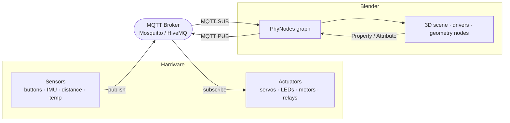

# PhyNodes

**Physical computing for Blender.** Wire sensors, actuators, and the physical
world into Blender through a native node editor — like shader nodes, but the
values come from real hardware over MQTT or OSC.

A temperature sensor rotates a dial. A distance sensor drives a mesh. A slider in
Blender dims a real LED. PhyNodes turns Blender into a live interface between the
3D scene and microcontrollers, robots, and installations.

Part of the **[Animaquina](https://www.animaquina.com)** robot-IDE family.
Ports the [mqttouch](https://github.com/luigipacheco/MqttTouch) (Godot) node
editor into Blender.

> Status: **beta** — under active development, APIs and nodes may change.

---

## What it's for



- **Sense** — subscribe to sensor topics and drive object transforms, custom
  properties, shape keys, or geometry-node inputs (via drivers).
- **Actuate** — read any Blender property or geometry-node attribute and publish
  it to a topic that a microcontroller turns into motion, light, or sound.
- **Prototype** — build a digital twin that mirrors hardware in real time, or
  test motion logic in Blender before it ever touches a motor.

Anything that speaks MQTT works: ESP32 / ESP8266 / Arduino (PubSubClient),
Raspberry Pi, Node-RED, Home Assistant, or a Python script on your bench.

## Features

- **Native node editor** — a dedicated *PhyNodes* node tree; add nodes from the
  categorized **Add** menu, wire them like shader nodes.
- **Live evaluation** — the graph is evaluated on a timer (default 20 Hz,
  adjustable); changes repaint the viewport without you clicking.
- **Bi-directional MQTT** — named broker connections (add several if you need
  them) with auto-reconnect; SUB nodes bring data in, PUB nodes send it out.
- **Bi-directional OSC** — receive on a UDP port, send to a host:port; talks
  to TouchOSC, Max/MSP, Pure Data, VJ tools, and mocap software. No broker
  needed.
- **Blender as I/O** — read/write object properties and **geometry-node
  attributes**; generate driver-ready custom properties.
- **Robot toolpath streaming** — follow an Animaquina run with the **Animaquina
  Index** node and publish any per-point attribute at the waypoint the robot is
  on, for extruders, LEDs, fans, or any FabNode.
- **Blender as a FabNode** — a connection can announce a **fabnodes/1.1**
  manifest (with `$state`, heartbeat, and `system/estop` fail-safe), so FabFlow
  discovers Blender like any ESP32.
- **Typed sockets** — Float / Int / Bool / Vector / Color / String / Any, with
  per-socket defaults shown in the N-panel, geometry-nodes style.
- **Time & math** — Scene Time, a continuous Timer, and a Blender-style Math
  node for LFOs, easing, and timing.
- **Nothing to install** — `paho-mqtt` and `python-osc` are bundled with the
  add-on.

## Requirements

- **Blender 4.2 or newer**
- For MQTT: an **MQTT broker** — e.g. [Mosquitto](https://mosquitto.org),
  HiveMQ, or the public test server `test.mosquitto.org`. OSC needs nothing —
  it's direct UDP.

`paho-mqtt` and `python-osc` are **bundled** and installed automatically, so
there's no `pip` step.

## Install

1. Download the latest **`phynodes-x.y.z.zip`** from Releases.
2. Blender → **Edit ▸ Preferences ▸ Get Extensions ▸ Install from Disk…**
   (or **Add-ons ▸ Install…**) and pick the zip.
3. Enable **PhyNodes**. Blender installs the bundled `paho-mqtt` on enable.

> Install from the **zip** so the bundled MQTT wheel is picked up. If MQTT can't
> connect after enabling, disable then re-enable the add-on once.

## Quick start

1. Open a **Node Editor**, switch the tree-type dropdown (header) to
   **PhyNodes**, and create a new node tree.
2. In the sidebar (**N ▸ PhyNodes ▸ Connections**), select the default MQTT
   connection (or add one with **＋**), set **Host** / **Port** /
   **Topic Prefix**, then **Connect**.
3. **Add ▸** pick nodes from the categories and wire them up.

### Drive a cube from a sensor

```
MQTT SUB  (topic: distance)
   └─▶ Map Range  (0..1023 → 0..3.14)
          └─▶ Custom Property  (name: dist)   →  Copy Var Path → ["dist"]
```

Add a **driver** to the cube's Rotation Z → *Single Property* variable, ID =
Scene, Path = `["dist"]`, expression `var`. Publish to `/phynodes/distance` and
the cube turns.

### Send Blender motion to an actuator

```
Property In  (bpy.data.objects["Cube"].location[2])
   └─▶ Math  (Multiply ×100)
          └─▶ MQTT PUB  (topic: servo)
```

Move the cube; a servo subscribed to `/phynodes/servo` follows.

### A continuous LFO (no playback needed)

```
Timer ──▶ Math (Sine) ──▶ Custom Property "wave"   (→ driver anything)
```

### Stream geometry-node data out

```
Geometry Attribute  (object, attribute: position, All Elements)
   └─▶ MQTT PUB  (topic: points)
```

### Stream toolpath attributes to FabNodes (robot fabrication)

The one that ties Blender, a robot, and hardware together: as a robot runs a
toolpath, publish **each waypoint's attributes** to the network so extruders,
LEDs, fans, or any FabNode react in sync with the motion.

The idea is a single shared **cursor**. Animaquina publishes the index of the
waypoint currently being executed; the **Animaquina Index** node reads it, and
each **Geometry Attribute** node looks up *its own* attribute at that index.
One index wire feeds any number of attributes.

```
                              ┌─▶ Geometry Attribute "PAR" ─▶ MQTT PUB  blender1/par
[Animaquina Index]            │
      Index ──────────────────┼─▶ Geometry Attribute "led" ─▶ MQTT PUB  blender1/led
      Running ──▶ (gate)      │
                              └─▶ Geometry Attribute "fan" ─▶ MQTT PUB  blender1/fan
```

**1 — Author the attributes.** On the toolpath mesh, store one value per
waypoint on the **Point** domain (Geometry Nodes → *Store Named Attribute*).
Names are entirely yours — `PAR`, `led`, `fan`. Booleans, floats, ints, and
colors all work (vectors/colors publish as JSON arrays).

**2 — Add the index.** *Add → Input → **Animaquina Index***, and pick the robot
slot. The node body shows the live cursor (`Stream 25 / 100`) as the toolpath
runs. Outputs:

| Output | Use |
|---|---|
| **Index** | the cursor — wire to every Geometry Attribute |
| **Running** | `False` while idle — gate publishing with this |
| **Count** | total waypoints |
| **Progress** | 0–1 along the run |

**3 — Look up each attribute.** Add a **Geometry Attribute** node per attribute,
pick the toolpath object and attribute, then **untick “All Elements”** — with it
on the node returns the whole array and the `Index` socket is hidden. Wire
`Index` into it.

**4 — Publish.** Wire each attribute into an **MQTT PUB** node and give it a
topic (`blender1/par`).

> **Gate on `Running`.** While idle the index is `-1`, which the attribute node
> clamps to point 0 — so an ungated graph publishes point 0's values forever.
> Feed `Running` into a **Switch** ahead of the PUB so it goes quiet when the
> robot isn't running.

**5 — Appear in FabFlow.** On the MQTT connection enable **Announce as FabNode**
(see below). Every PUB/SUB node becomes a port on a `fab-blender` node that
FabFlow discovers automatically.

Adding another streamed attribute later is just: name it on the mesh → one more
Geometry Attribute + MQTT PUB → wire the same Index. Nothing changes on the
Animaquina side, and the FabFlow node picks up the new port within a second.

### Announce Blender as a FabNode

A PhyNodes MQTT connection can present itself as a node on a **fabnodes/1.1**
network, so [FabFlow](https://www.animaquina.com) discovers Blender like any
ESP32 — no configuration on the hub side.

In the **Connections** panel, enable **Announce as FabNode**, set a node name
(`blender1`) and type (`fab-blender`), and **Connect**. PhyNodes then:

- publishes a retained manifest to `fabnodes/manifest/<name>` (mirrored to
  `<name>/$info`), with one signal per MQTT PUB/SUB node using that connection —
  **re-published automatically whenever you change the graph**;
- keeps `<name>/$state` at `online` / `offline` (Last Will on an unclean exit)
  and beats `<name>/diag/uptime` every 15 s so FabFlow can show it live;
- subscribes `system/estop` and **suppresses all PUB output while the e-stop is
  latched**, acknowledging on `<name>/status/safe`.

💡 Set the connection's **Topic Prefix to empty** and name PUB topics
`blender1/par` so FabFlow shows clean port labels (`par`) instead of the full
`/phynodes/...` path.

### Drive Blender from TouchOSC

Add a connection, set its **Type** to **OSC** (defaults: listen on `9001`,
send to `127.0.0.1:9000`), and **Connect**. Point TouchOSC at your machine's
IP, port `9001`.

```
OSC In  (address: /1/fader1)
   └─▶ Map Range  (0..1 → 0..6.28)
          └─▶ Custom Property  (name: spin)   →  driver as usual
```

`OSC Out` works the same way in reverse — wire any value into it and it sends
to the connection's send host/port.

## Node reference

### Inputs
| Node | Output |
|------|--------|
| **Value** | A 0–1 slider remapped to a Min/Max range |
| **Boolean** | A toggle (0/1) |
| **Integer** / **Vector** / **String** | Typed constants |
| **Color** | RGBA picker → `[r,g,b,a]` |
| **Scene Time** | Frame and Seconds from the timeline |
| **Timer** | Continuous wall-clock seconds, with Reset |
| **Property In** | Reads a Blender data path |
| **Animaquina Index** | Current waypoint of a running toolpath: Index, Running, Count, Progress |
| **Geometry Attribute** | Reads a mesh / geometry-nodes attribute (scalar, vector, or per-element array); wire **Index** to look one point up |
| **MQTT SUB** | Latest message on a topic (parses JSON / CSV / number / string) |
| **OSC In** | Latest value on an OSC address (already typed; multi-arg → array) |

### Processors
| Node | Does |
|------|------|
| **Math** | Mirrors Blender's Math node; element-wise on arrays |
| **Map Range** | Linear remap between two ranges |
| **Clamp** | Constrain to `[min, max]` |
| **Easing** | Remap a 0–1 factor through a Penner easing curve (sine/quad/cubic/expo/circ/back/elastic/bounce, in/out/in-out) into a Min/Max range |
| **Float Curve** | Remap a 0–1 factor through a hand-drawn curve (Blender's native curve widget) into a Min/Max range |
| **Compare** | `<, <=, >, >=, ==, !=` → boolean |
| **Switch** | A boolean selects between two inputs |
| **Array** | Combine many inputs (multi-input socket) into an array |
| **Array Reduce** | Collapse an array to one value (sum, average, min/max, range, median, count, first/last) |
| **String Op** | Text ops: concatenate, case, strip, replace, slice, length, contains, split, join (sockets adapt to the operation) |
| **JSON Parse / Stringify** | Text ⇄ value |

### Outputs
| Node | Does |
|------|------|
| **Custom Property** | Generates a driver-ready custom property (`scene["name"]`) of a chosen type; **Copy Var Path** for a driver variable |
| **Set Property** | Writes directly into an existing data path each tick |
| **MQTT PUB** | Publishes the input to a topic (on change) |
| **OSC Out** | Sends the input to an OSC address (on change; arrays → argument list) |
| **Debug** | Shows the latest value in the node body |

**Sinks** (Custom Property, Set Property, MQTT PUB, OSC Out, Debug) are the
roots the timer evaluates each tick; everything upstream is pulled lazily and
memoized.

## Typed sockets

Every socket carries a **data type** (Float / Int / Bool / Vector / Color /
String / Any) that drives its default widget and color — like geometry-node
sockets. Connections are permissive (any-to-any); types only shape the unlinked
default. Select a node and open the **N-panel** to edit per-socket type, default,
and optional min/max.

## Architecture

| File | Role |
|------|------|
| `tree.py` | The PhyNodes node tree + typed Variant socket |
| `base.py` | Node base class, pull-based memoized evaluation |
| `values.py` | bpy-free value/payload utilities (unit-tested in `tests/`) |
| `evaluator.py` | The timer: evaluates sink nodes and requests redraws |
| `connectors/` | Transport layer: `base.py` (connector interface + threading contract), `mqtt.py` (threaded `paho-mqtt` with auto-reconnect), `osc.py` (`python-osc` UDP server + client), registry in `__init__.py` |
| `settings.py` | Scene-level connections list + refresh interval |
| `nodes/` | One module per node; `io_base.py` is the shared base for transport I/O nodes |
| `ui.py` | Categorized Add menu + Connections N-panel |

Evaluation is **pull-based**: each node computes its output by pulling upstream
inputs (cached per tick, cycle-guarded). Sink nodes are the entry points the
~50 ms timer drives.

## Building from source

**Any OS** — Blender's own extension builder (recommended):

```sh
blender --command extension build --source-dir . --output-dir .
```

**Windows / PowerShell** — convenience script that also compile-checks and can
sync into Blender for testing:

```powershell
.\build.ps1                       # compile-check + build phynodes-<version>.zip
.\build.ps1 -Sync                 # also copy into Blender's extensions folder
.\build.ps1 -Sync -Blender 5.2    # target a specific Blender version
```

The zip keeps `blender_manifest.toml` at its root (required by Blender) and
bundles the `paho-mqtt` and `python-osc` wheels from `wheels/`. To refresh
them:

```sh
python -m pip download paho-mqtt python-osc --only-binary=:all: --no-deps -d wheels
```

## Troubleshooting

- **No nodes in the Add menu** — set the node editor's tree type to *PhyNodes*
  and make sure the add-on is enabled. After updating, **fully restart Blender**
  (a "Reload Scripts" can drop the evaluation timer).
- **A value doesn't propagate** — it only flows if it's wired to a **sink**
  (Custom Property / Set Property / MQTT PUB / Debug), and the graph is
  **Enabled** in the N-panel.
- **Can't connect** — check the connection's host/port; status and errors show
  in the Connections panel. Once connected, a dropped broker reconnects
  automatically.
- **paho-mqtt not installed** — install from the **zip** (so the bundled wheel
  is used), then disable/enable the add-on once.

## Roadmap

- More transports behind the connector layer (landed in 0.2; OSC in 0.3):
  **Zenoh** next (broker-less peer mode + ROS 2 interop), then serial, …
- Geometry-Nodes-style typed sockets, unit subtypes, node groups
- Digital-twin helpers: record/playback, two-way binding, output safety
- Writing back into geometry attributes

See [plan.md](plan.md) for the full architecture plan and phased roadmap.

## License & credits

GPL-3.0-or-later. Built on the ideas of
[mqttouch](https://github.com/luigipacheco/MqttTouch) and the original Blender
MQTT addon by Aurel Wildfellner. Part of **Animaquina** by Luis Arturo
Pacheco — <https://www.animaquina.com>.
